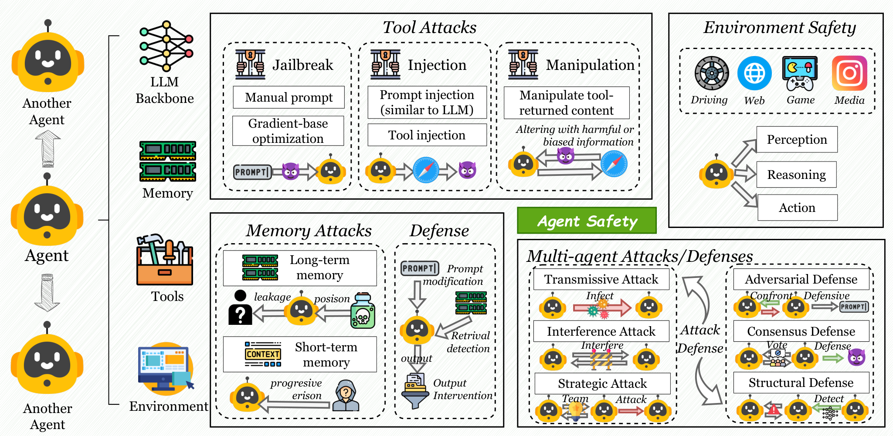

## Survey

<!-- ### Trustworthy AI Description -->

- [x] [arXiv 2025] **AI Safety vs. AI Security: Demystifying the Distinction and Boundaries.**   

  
  
AI Safety vs. AI Security

Building trustworthy AI requires addressing both AI safety and AI security concerns. AI safety focuses on preventing unintended failures, including system malfunctions, design limitations, and unexpected behaviors that can arise during normal operation. In contrast, AI security addresses malicious exploitation threats, such as deliberate system manipulation, data poisoning attacks, and adversarial perturbations designed to compromise AI systems.

- [ ] [arXiv 2025] **A Comprehensive Survey in LLM(-Agent) Full Stack Safety: Data, Training and Deployment**  

  

    
    
Full Stack Safety

  

  

    
    
Agent System

  

  

    
    
Agent Safety

  

This work defines the complete LLM lifecycle as encompassing data preparation, pre-training, post-training, deployment, and final commercialization. This comprehensive survey is grounded in an exhaustive review of over 900 papers and provides valuable guidance for researchers pursuing future work in this field.

- [ ] [arXiv 2025] **A Survey on AgentOps: Catagorization, Challenges, and Future Directions.**  

  
  
Agent Anomalies Detection

This work conducts a comprehensive survey on agent system operations, establishing a clear framework for the field and defining key challenges to facilitate future development. The study systematically categorizes anomalies within agent systems into intra-agent and inter-agent anomalies, and introduces a novel operational framework for agent systems.

- [ ] [arXiv 2025] **Safety at Scale: A Comprehensive Survey of Large Model and Agent Safety.**    

## AI Safety
### Alignment

- [ ] [arXiv 2025] **STAIR: Improving Safety Alignment with Introspective Reasoning.**   

- [ ] [arXiv 2025] **RealSafe-R1: Safety-Aligned DeepSeek-R1 without Compromising Reasoning Capability.**   

## AI Security
### Jailbreak Attacks

- [ ] [NeurIPS 2024] **Bag of Tricks: Benchmarking of Jailbreak Attacks on LLMs.**   

  
  
Benchmarking jailbreak attacks on LLMs

- [ ] [ACL 2025] **Jailbreak Large Vision-Language Models Through Multi-Modal Linkage.** 

- [ ] [arXiv 2024] **Heuristic-Induced Multimodal Risk Distribution Jailbreak Attack for Multimodal Large Language Models.**  

- [ ] [arXiv 2025] **Implicit Jailbreak Attacks via Cross-Modal Information Concealment on Vision-Language Models.** 

